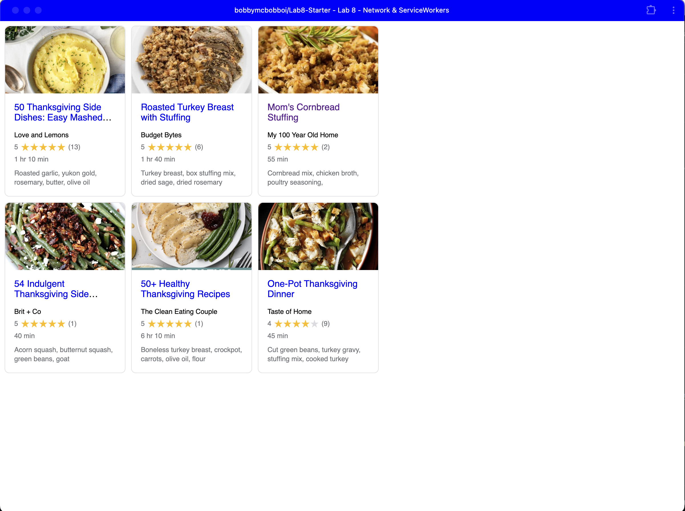

# Lab8-Starter
name: Ryan Lin
pages url: https://bobbymcbobboi.github.io/Lab8-Starter/
How are graceful degradation and service workers related?
Service workers can help your app provide graceful degradation in the form of not needing the internet all the time.
It does this by allowing your app to function even when not connected to the internet.

